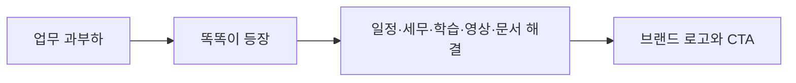
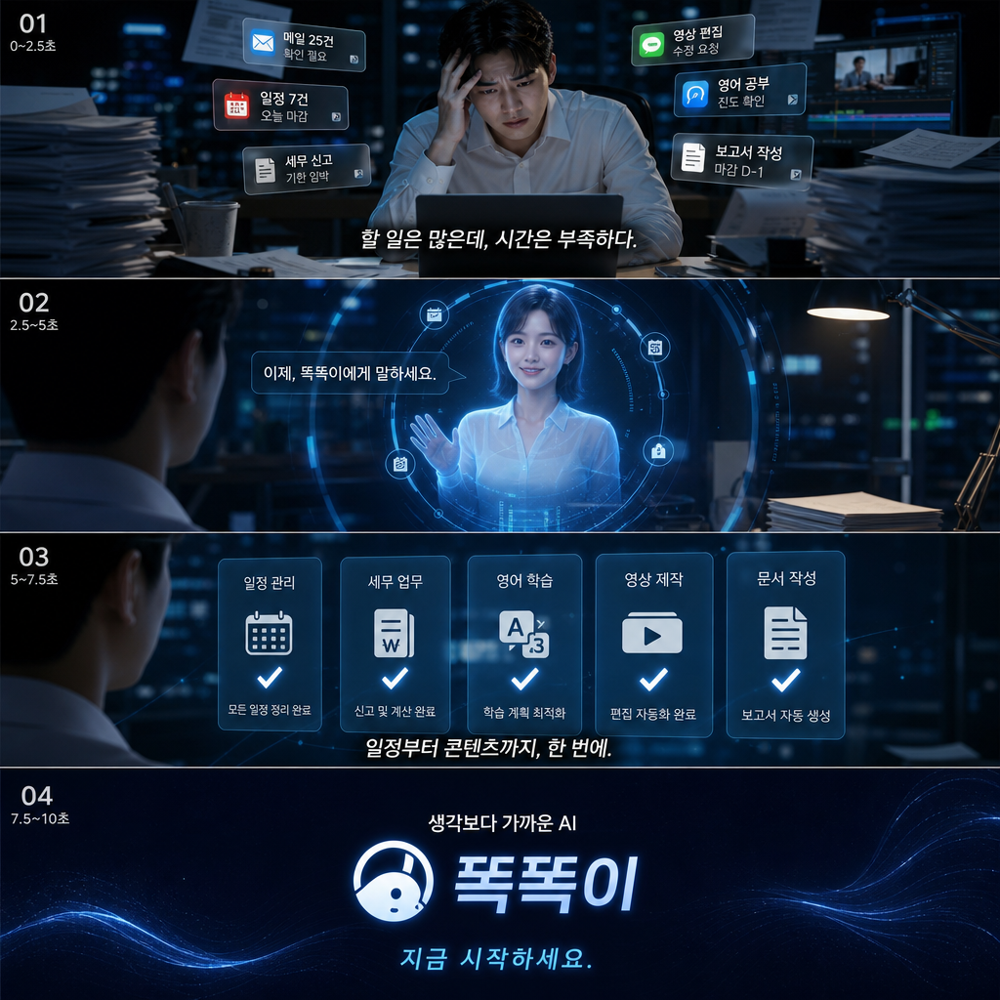
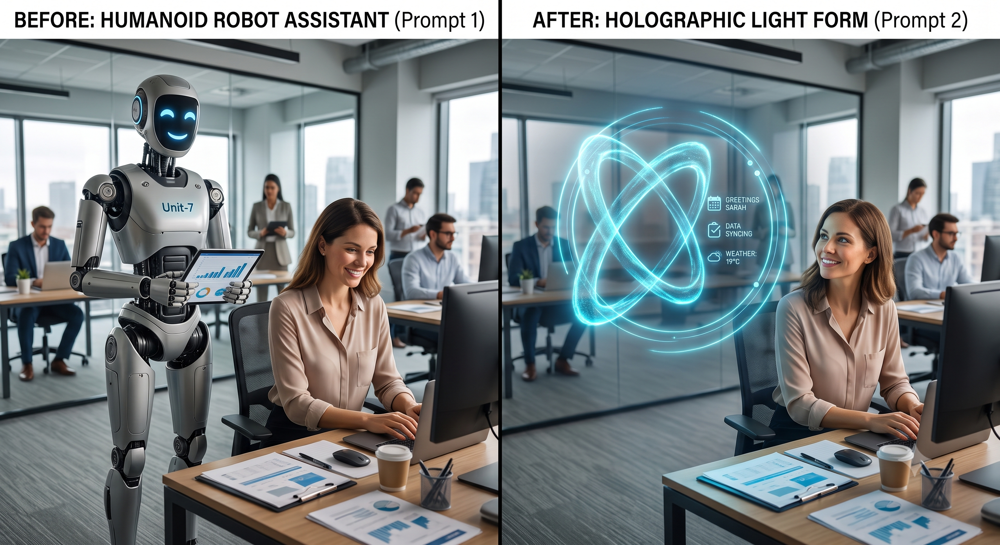

# Codyssey C1-2 · AI 브랜드 광고 영상 제작


> AI 개인비서 브랜드 **똑똑이(TTOKTTOK AI)**의 가치를 10초 안에 전달하는 생성형 AI 기반 광고 영상 프로젝트입니다.

## 한눈에 보기

| 항목 | 내용 |
|---|---|
| 브랜드 | 똑똑이 · 개인화 AI 비서 |
| 목표 | 업무 과부하를 AI 비서가 해결한다는 메시지 전달 |
| 서사 | 문제 제시 → AI 등장 → 업무 해결 → 브랜드 CTA |
| 제작 방식 | Text-to-Image → 검수 → Image-to-Video → 편집·오디오 통합 |
| 주요 도구 | 이미지 생성 AI, Kling/Runway, ElevenLabs, Suno, CapCut |
| 현재 산출물 | 스토리보드, 프롬프트 개선 비교, 최종 MP4, 상세 기획서 |

## 브랜드 메시지

> 할 일은 많고, 시간은 부족하다. 이제, 똑똑이에게 말하세요.

똑똑이는 일정 관리, 문서 작성, 세무 업무, 영어 학습, 영상 제작 등 사용자의 여러 업무를 하나의 흐름으로 지원하는 개인비서형 AI를 지향합니다.

## 광고 구조



| Scene | 시간 | 전달할 메시지 |
|---|---:|---|
| 01 | 0.0–2.5초 | 할 일은 많고 시간은 부족하다 |
| 02 | 2.5–5.0초 | 이제 똑똑이에게 말하세요 |
| 03 | 5.0–7.5초 | 일정부터 콘텐츠까지 한 번에 |
| 04 | 7.5–10.0초 | 생각보다 가까운 AI, 똑똑이 |



## 프롬프트 개선 사례

초기 휴머노이드 로봇 표현은 브랜드가 차갑고 기계적으로 보이는 문제가 있었습니다. 이를 푸른 홀로그램 빛과 미니멀 UI로 바꿔 친근함·신뢰감·미래성을 함께 표현했습니다.



| 항목 | 초기안 | 개선안 |
|---|---|---|
| AI 비서 표현 | 실물 휴머노이드 로봇 | 푸른 홀로그램 빛과 UI |
| 인상 | 기계적·낯섦 | 친근함·신뢰감 |
| 브랜드 연결 | 범용 로봇 이미지 | 개인비서형 AI 정체성 |
| 시각 일관성 | 씬별 변형 위험 | 컬러·빛·UI 규칙으로 통제 |

## 제출물 상태

| 항목 | 상태 | 근거 |
|---|---|---|
| 브랜드 전략·스토리보드 | ✅ 완료 | [상세 기획서](docs/archive/production-report.md), 스토리보드 이미지 |
| 프롬프트 수정 전·후 | ✅ 완료 | 비교 이미지와 기획서 |
| AI 기반 제작 파이프라인 | ✅ 문서화됨 | 기획 → 생성 → 검수 → 편집 과정 |
| 최종 MP4 파일 | ✅ 존재 | [`assets/video/ttokttok-ad-horizontal.mp4`](assets/video/ttokttok-ad-horizontal.mp4) |
| 세로형 9:16 납품본 | ⚠️ 재출력 필요 | 현재 파일은 1280×720 가로형 |
| 10초 이내 납품본 | ⚠️ 재출력 필요 | 현재 파일 길이는 10.03초 |

현재 MP4는 **10.03초, 1280×720**입니다. 기획서의 9:16 세로형·10초 이내 규격을 만족하는 최종 납품본으로 표기하지 않습니다. 원본 CapCut 프로젝트 또는 편집 소스에서 **1080×1920, 최대 10.00초**로 재출력한 뒤 `assets/video/ttokttok-ad-vertical.mp4`로 추가해야 합니다.

## 제작 규격

| 구분 | 제출 기준 | 현재 상태 |
|---|---|---|
| 화면 비율 | 9:16 세로형 | 재출력 필요 |
| 해상도 | 1080×1920 권장 | 재출력 필요 |
| 길이 | 10초 이내 | 0.03초 초과 |
| 영상 코덱 | H.264 권장 | 원본 편집본에서 확인 필요 |
| 오디오 | AI 음성·BGM·효과음 중 하나 이상 | 상세 기획서에 설계 기록 |
| 스톡·직접 촬영 | 사용 여부 명시 | 미사용으로 문서화됨 |

## 재출력 체크리스트

1. CapCut에서 프로젝트 캔버스를 `9:16 / 1080×1920`으로 설정합니다.
2. 4개 장면이 안전 영역 안에 오도록 재배치합니다.
3. 타임라인 마지막 프레임을 10.00초 이전으로 잘라냅니다.
4. 로고와 CTA가 마지막 2.5초에 충분히 노출되는지 확인합니다.
5. H.264 MP4로 내보낸 뒤 `assets/video/ttokttok-ad-vertical.mp4`에 저장합니다.
6. `evidence/manifest.toml`의 `vertical_delivery_video` 상태를 `complete`로 바꿉니다.
7. 검증 명령을 실행한 뒤 `main`에 직접 반영합니다.

## 검증

```powershell
$env:PYTHONPATH = "src"
python -m c1_2_quality validate
python -m unittest discover -s tests -v
```

검증기는 매니페스트의 완료 항목이 실제 파일을 가리키는지 검사합니다. 영상의 재생시간·해상도는 내보내기 뒤 미디어 속성으로 다시 확인합니다.

## 저장소 구조

```text
.
├─ assets/
│  ├─ images/             # 스토리보드와 프롬프트 개선 이미지
│  └─ video/              # 현재본과 향후 세로형 납품본
├─ docs/
│  ├─ archive/            # 기존 상세 기획서 원문
│  ├─ mission/            # 미션 적합성 판정
│  └─ production/         # 납품·재출력 규격
├─ evidence/              # 요구사항 매니페스트
├─ src/c1_2_quality/      # 증빙 검증 CLI
├─ tests/
└─ .github/workflows/
```

## 관련 문서

- [미션 적합성 검토](docs/mission/compliance.md)
- [영상 납품 규격](docs/production/delivery-spec.md)
- [기존 상세 기획서](docs/archive/production-report.md)
- [기여·운영 규칙](CONTRIBUTING.md)
